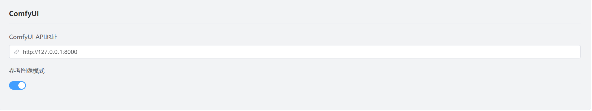
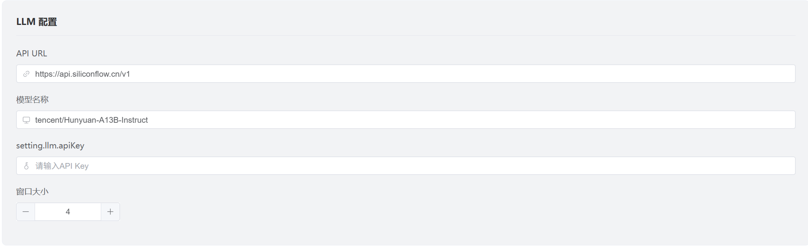
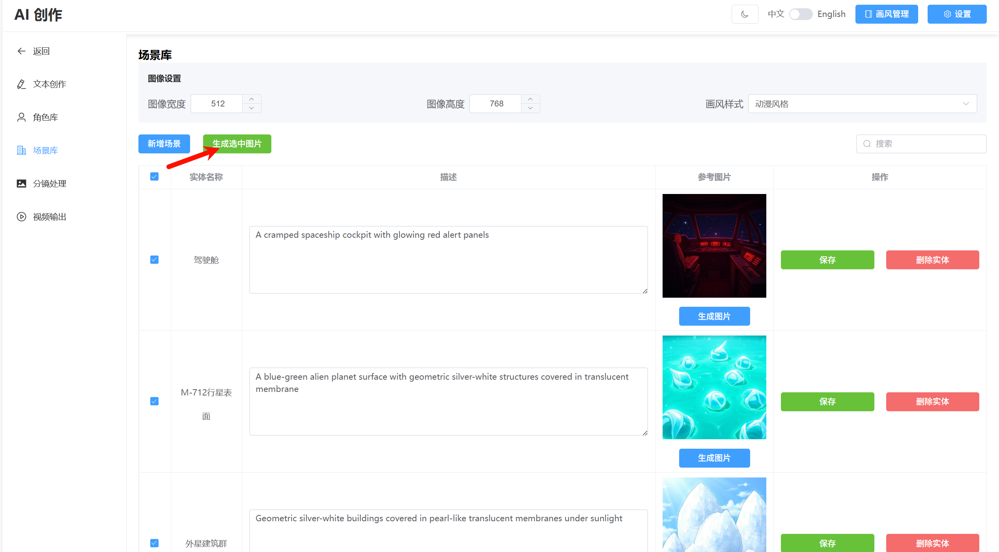
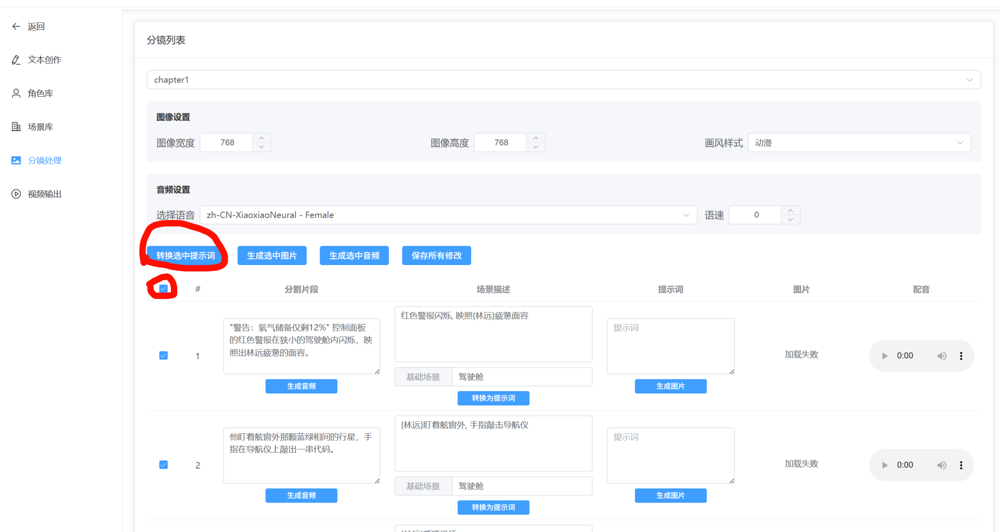
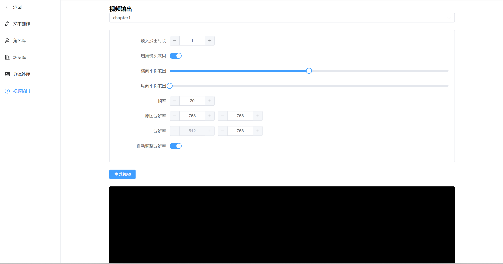

# <p align="center">AI Creation - 智能创意内容生成系统</p>

<div align="center">

[中文](README.md) | [English](README_EN.md)

[功能介绍](#功能介绍) | [安装说明](#安装说明) | [运行指南](#运行指南) | [配置说明](#配置说明) | [使用流程](#使用流程) | [项目结构](#项目结构)

</div>

## News
- [2025-8-20] 🎉 全新开源项目发布：正式推出了专注于长篇小说创作的 AI 工具——[NovelForge](https://github.com/RhythmicWave/NovelForge)！如果你希望更专业、更高效地完成小说创作与内容管理，欢迎来体验并提出建议。
- [2025-7-1] 🔥重大更新: 引入Flux Kontext，略微降低生成速度，显著增加角色一致性；新增画风管理功能，添加画风预设（画风预设参考sdxl_prompt_styler）

## 功能介绍

本项目是一个智能创意内容生成系统，能够帮助用户：
- 快速生成创意文本内容
- 利用 AI 技术实现图像生成
- 自动进行视频合成
- 通过Flux Kontext保持一致性（实验性）

系统架构：
- 前端：VUE3 + TypeScript + Element Plus
- 后端：基于 Python FastAPI 框架
- AI 模型：支持 OpenAI 兼容的 API 接口，使用LangChain调用LLM
- 图像生成：集成 ComfyUI
- 音频生成： 集成EdgeTTS
- 内容管理：基于文件系统的结构化存储

### 输出视频展示


https://github.com/user-attachments/assets/f7ca6d56-fd7a-4a3e-aaad-de39cdda456f


## 安装说明

### 环境要求
- Python >= 3.10
- Node.js
- ComfyUI>=0.3.43

### 安装步骤

1. 安装后端依赖
```bash
cd server
pip install -r requirements.txt
```

2. 安装前端依赖
```bash
cd client
npm install
```

3. ComfyUI 模型配置
- 通过ComfyUI Manager安装节点:comfy-plasma
- 通过ComfyUI Manager安装节点:ComfyUI-nunchaku(v0.3.3)
- 在ComfyUI\custom_nodes\ComfyUI-nunchaku\example_workflows中找到install_wheel.json，放入ComfyUI中，选择最新version(目前是v0.3.1)，运行工作流，自动安装nunchaku
- 确保已经安装了CUDA

> **本项目所需模型如下**：
- [clip_l](https://www.modelscope.cn/models/comfyanonymous/flux_text_encoders/files)（存放路径：ComfyUI\models\text_encoders）
- [t5xxl_fp8_e4m3fn](https://www.modelscope.cn/models/comfyanonymous/flux_text_encoders/files)（同上）
- [flux-vae](https://www.modelscope.cn/models/muse/flux_vae/files)(下载ae.safetensors，存放路径：ComfyUI\models\vae)
- [FLUX.1-Turbo-Alpha](https://www.modelscope.cn/models/alimama-creative/FLUX.1-Turbo-Alpha/files)（下载diffusion_pytorch_model.safetensors，重命名为flux.1-turbo-alpha.safetensors，存放路径：ComfyUI\models\loras）
- [flux.1-kontext-dev](https://modelscope.cn/models/Lmxyy1999/nunchaku-flux.1-kontext-dev/files)
  - 50显卡下载：svdq-fp4_r32-flux.1-kontext-dev.safetensors
  - 非50显卡下载：svdq-int4_r32-flux.1-kontext-dev.safetensors
    存放路径：ComfyUI\models\diffusion_models
- 50显卡下载：
[svdq-fp4-flux.1-dev](https://www.modelscope.cn/models/mit-han-lab/svdq-fp4-flux.1-dev/files)（下载整个文件夹，存放路径：ComfyUI\models\diffusion_models）
- 非50显卡下载：
[svdq-int4-flux.1-dev](https://www.modelscope.cn/models/mit-han-lab/svdq-int4-flux.1-dev)（同上）


## 运行指南

1. 启动后端服务
```bash
cd server
python app.py
```

2. 启动前端服务
```bash
cd client
npm run dev
```

3. 启动 ComfyUI
- 默认使用 nunchaku-flux.1-dev 工作流（显存要求 10GB+）
- 工作流路径：`server/workflow`（可自行扩展）

> **注意**：使用默认工作流时，请确保所需模型已正确下载并放置。对于非 50 系显卡，请将 svdq-fp4_r32-flux.1-kontext-dev.safetensors 模型替换为 int4 版本。如果项目开启了参考图像模式（默认开启），那么还需要修改nunchaku-flux-kontext-multi-images工作流中的模型为int版本


## 配置说明

1. 进入系统配置页面


2. 参考图像模式


默认开启，在生成分镜图片时将会自动参考对应的角色或者场景图，若关闭，则使用实体提示词嵌入方式来尽量保证一致性，生成速度更快。

3. 配置 LLM 服务


需要关注的配置：
- ComfyUI API地址
- LLM API URL
- API Key
- 模型名称

> **没有Key？获取 API Key的方法**：
> 通过 [注册链接](https://cloud.siliconflow.cn/i/7JM0ZZTT) 可获得 2000 万免费 token
> 注册后在主页面选择：API密钥 → 新建API密钥

修改配置后可能需要重启server

## 使用流程

### 1. 创建项目

### 2. 文本创作
- 创作模式：直接输入需求，AI 生成内容
- 续写模式：输入已有文本，AI 继续创作

### 3. 角色提取

- 保存文本后点击"提取角色"
- AI 将分析文本并提取角色信息


#### 3.1 角色库
角色提取后可在角色库查看提取结果，如果开启了"参考图像模式",那么需要为所有角色生成参考图。


- 若参考图不满意，可多次生成，或自行修改提示词重新生成(修改提示词后记得点保存按钮)。
- 为了后续图片生成效果，角色参考图尽量生成全身图片，可多次生成尝试。
- 增加上传本地参考图片功能，注意上传的图片最好和描述词相符合。

### 4. 章节分割

- 点击"分割当前章节"
- 系统自动提取场景并进行分镜

#### 4.1 场景库
分割完成后进入场景库可看到提取的场景
类似角色库，这里同样需要为所有场景生成参考图


### 5. 分镜处理


a) 提示词转换：
- 全选元素
- 点击"转换选中的提示词"
- 保存修改
- 注意
   - 场景描述中自动引用的实体可能不全，此时可以手动添加引用，格式{entity_name}
   - 是否开启参考图像模式会影响提示词转换模式，如果切换了参考图像模式，需要重新生成提示词

b) 图片生成：
- 可配置分辨率和画风（注意：当使用参考图像模式时，建议设置画风为基础，不需要另设画风）
- 当使用参考图像模式时，工作流会自动切换至nunchaku-flux-kontext-multi-images。但是目前最多支持同时出现两个参考人物和一个参考场景
- 点击"生成选中的图片"
- 支持单独重新生成，或自行微调提示词，以生成预期的图片

c) 音频生成：
- 选择需要的片段
- 点击生成音频

### 6. 视频生成

- 切换到视频生成界面
- 根据分镜处理时生成的图像分辨率设置原图分辨率
- 设置横向平移范围或纵向平移范围时，可以点击计算推荐分辨率按钮，将会根据横向平移或纵向平移设置按比例调整推荐的视频分辨率宽度或高度。也可以不使用此功能，自由设置分辨率，但可能造成图片显示不完全的情况
- 点击"生成视频"（约需1分钟）


#### 视频硬编码加速配置(可选)

如需启用 NVIDIA GPU 加速（NVENC），请：

1. 下载并解压 FFmpeg Builds
2. 配置环境变量：
   - 将 FFmpeg bin 目录添加到 PATH
   - 确保已安装 NVIDIA 驱动
3. 验证配置：
   ```bash
   ffmpeg -encoders | findstr nvenc
   ```
   显示 h264_nvenc 即表示配置成功

> 注：没有设置时将自动使用 CPU 编码

## 项目结构

```
AICreation/                # 项目根目录
├── client/               # 前端代码
│   ├── src/             # 源代码目录
│   │   ├── api/         # API 接口目录
│   │   │   ├── project_api.ts # 项目相关 API
│   │   │   ├── chapter_api.ts # 章节相关 API
│   │   │   ├── entity_api.ts # 实体相关 API
│   │   │   ├── media_api.ts # 媒体生成相关 API
│   │   │   └── request.ts # 请求封装，支持普通请求（Axios）和流式请求（Fetch API）处理
│   │   ├── components/   # 组件目录
│   │   │   ├── Header.vue # 顶部导航组件
│   │   │   └── ImageSettingsControl.vue # 图像设置组件
│   │   ├── composables/ # 组合式函数目录
│   │   │   └── useGeneration.ts # 通用生成逻辑
│   │   ├── locales/     # 国际化文件目录
│   │   │   ├── en-US.ts # 英文语言包
│   │   │   ├── zh-CN.ts # 中文语言包
│   │   │   └── index.ts # 国际化配置
│   │   ├── router/      # 路由配置目录
│   │   │   └── index.ts # 路由配置文件
│   │   ├── store/       # 状态管理目录
│   │   │   └── usePromptStyleStore.ts # 提示词风格状态管理
│   │   ├── styles/      # 样式文件目录
│   │   ├── utils/       # 工具类目录
│   │   ├── views/       # 页面视图目录
│   │   │   ├── Project/ # 项目管理页面
│   │   │   │   └── index.vue
│   │   │   ├── ProjectMain/ # 项目详情页面
│   │   │   │   ├── index.vue # 项目主页面
│   │   │   │   ├── EntityLibrary/ # 实体库 (角色与场景)
│   │   │   │   │   └── index.vue
│   │   │   │   ├── StoryboardProcess/ # 分镜流程管理
│   │   │   │   │   └── index.vue
│   │   │   │   ├── TextCreation/ # 文本创作管理
│   │   │   │   │   └── index.vue
│   │   │   │   └── VideoOutput/ # 视频输出管理
│   │   │   │       └── index.vue
│   │   │   ├── PromptStyler/ # 提示词风格管理
│   │   │   │   └── index.vue
│   │   │   ├── Setting/ # 设置页面
│   │   │   │   └── index.vue
│   │   │   └── NotFound/ # 404页面
│   │   │       └── index.vue
│   │   ├── App.vue      # 根组件
│   │   ├── main.ts      # 入口文件
│   │   └── env.d.ts     # 类型声明文件
│   ├── public/          # 静态资源目录
│   ├── index.html       # HTML 模板
│   ├── package.json     # 项目配置文件
│   ├── tsconfig.json    # TypeScript 配置
│   └── vite.config.ts   # Vite 配置
├── server/               # 服务器端代码
│   ├── config/           # 配置文件夹
│   │   ├── config.py     # 配置文件操作接口
│   │   └── config.yaml   # 系统配置文件
│   ├── controllers/      # API 接口层
│   │   ├── project_controller.py # 项目管理相关接口
│   │   ├── chapter_controller.py # 章节管理相关接口
│   │   ├── entity_controller.py # 实体管理相关接口
│   │   ├── media_controller.py   # 媒体生成相关接口
│   │   ├── video_controller.py   # 视频生成相关接口
│   │   └── admin_controller.py   # 系统管理接口（包括配置文件修改）
│   ├── services/         # 业务逻辑层
│   │   ├── llm_service.py    # LLM 相关业务逻辑
│   │   ├── image_service.py  # 图像生成相关业务逻辑
│   │   ├── audio_service.py  # 音频生成相关业务逻辑
│   │   ├── video_service.py  # 视频生成相关业务逻辑
│   │   ├── workflow_service.py # 工作流相关业务逻辑
│   │   ├── kg_service.py     # 知识图谱管理相关业务逻辑
│   │   ├── scene_service.py  # 场景相关业务逻辑
│   │   ├── chapter_file_service.py # 章节文件相关业务逻辑
│   │   ├── schemas.py        # Pydantic 数据模型与 JSON Schema 追加工具
│   │   └── base_service.py   # 服务基类 (含单例)
│   ├── utils/            # 工具类
│   │   ├── image_effect.py   # 图像特效工具
│   │   └── response.py       # API响应封装工具
│   ├── prompts/          # 提示词模板文件夹
│   │   ├── novel_writing.txt     # 小说写作提示词
│   │   ├── character_extraction.txt # 角色提取提示词
│   │   └── scene_extraction.txt  # 场景提取提示词
│   └── workflow/         # 工作流配置文件夹
│       └── nunchaku-flux.1-dev.json # 默认工作流配置文件
├── projects/             # 项目文件夹（与 server 同级）
│   ├── project1/         # 具体项目文件夹
│   │   ├── kg.json       # 知识图谱数据文件
│   │   ├── last_content.txt  # 最新生成的内容
│   │   ├── chapter1/     # 章节文件夹
│   │   │   ├── content.txt   # 章节内容文件
│   │   │   ├── 1/       # 子文件夹
│   │   │   │   ├── span.txt
│   │   │   │   ├── prompt.json
│   │   │   │   ├── image.png
│   │   │   │   └── audio.mp3
│   │   │   ├── 2/       # 子文件夹
│   │   │   └── ...      # 其他子文件夹
│   │   └── ...          # 其他章节文件夹
│   └── ...              # 其他项目文件夹
└── README.md            # 项目说明文档
```

详细目录结构：

```
AICreation/                # 项目根目录
├── client/               # 前端代码
│   ├── src/             # 源代码目录
│   │   ├── api/         # API 接口目录
│   │   │   ├── project_api.ts # 项目相关 API
│   │   │   ├── chapter_api.ts # 章节相关 API
│   │   │   ├── entity_api.ts # 实体相关 API
│   │   │   ├── media_api.ts # 媒体生成相关 API
│   │   │   └── request.ts # 请求封装，支持普通请求（Axios）和流式请求（Fetch API）处理
│   │   ├── components/   # 组件目录
│   │   │   ├── Header.vue # 顶部导航组件
│   │   │   └── ImageSettingsControl.vue # 图像设置组件
│   │   ├── composables/ # 组合式函数目录
│   │   │   └── useGeneration.ts # 通用生成逻辑
│   │   ├── locales/     # 国际化文件目录
│   │   │   ├── en-US.ts # 英文语言包
│   │   │   ├── zh-CN.ts # 中文语言包
│   │   │   └── index.ts # 国际化配置
│   │   ├── router/      # 路由配置目录
│   │   │   └── index.ts # 路由配置文件
│   │   ├── store/       # 状态管理目录
│   │   │   └── usePromptStyleStore.ts # 提示词风格状态管理
│   │   ├── styles/      # 样式文件目录
│   │   ├── utils/       # 工具类目录
│   │   ├── views/       # 页面视图目录
│   │   │   ├── Project/ # 项目管理页面
│   │   │   │   └── index.vue
│   │   │   ├── ProjectMain/ # 项目详情页面
│   │   │   │   ├── index.vue # 项目主页面
│   │   │   │   ├── EntityLibrary/ # 实体库 (角色与场景)
│   │   │   │   │   └── index.vue
│   │   │   │   ├── StoryboardProcess/ # 分镜流程管理
│   │   │   │   │   └── index.vue
│   │   │   │   ├── TextCreation/ # 文本创作管理
│   │   │   │   │   └── index.vue
│   │   │   │   └── VideoOutput/ # 视频输出管理
│   │   │   │       └── index.vue
│   │   │   ├── PromptStyler/ # 提示词风格管理
│   │   │   │   └── index.vue
│   │   │   ├── Setting/ # 设置页面
│   │   │   │   └── index.vue
│   │   │   └── NotFound/ # 404页面
│   │   │       └── index.vue
│   │   ├── App.vue      # 根组件
│   │   ├── main.ts      # 入口文件
│   │   └── env.d.ts     # 类型声明文件
│   ├── public/          # 静态资源目录
│   ├── index.html       # HTML 模板
│   ├── package.json     # 项目配置文件
│   ├── tsconfig.json    # TypeScript 配置
│   └── vite.config.ts   # Vite 配置
├── server/               # 服务器端代码
│   ├── config/           # 配置文件夹
│   │   ├── config.py     # 配置文件操作接口
│   │   └── config.yaml   # 系统配置文件
│   ├── controllers/      # API 接口层
│   │   ├── project_controller.py # 项目管理相关接口
│   │   ├── chapter_controller.py # 章节管理相关接口
│   │   ├── entity_controller.py # 实体管理相关接口
│   │   ├── media_controller.py   # 媒体生成相关接口
│   │   ├── video_controller.py   # 视频生成相关接口
│   │   └── admin_controller.py   # 系统管理接口（包括配置文件修改）
│   ├── services/         # 业务逻辑层
│   │   ├── llm_service.py    # LLM 相关业务逻辑
│   │   ├── image_service.py  # 图像生成相关业务逻辑
│   │   ├── audio_service.py  # 音频生成相关业务逻辑
│   │   ├── video_service.py  # 视频生成相关业务逻辑
│   │   ├── workflow_service.py # 工作流相关业务逻辑
│   │   ├── kg_service.py     # 知识图谱管理相关业务逻辑
│   │   ├── scene_service.py  # 场景相关业务逻辑
│   │   ├── chapter_file_service.py # 章节文件相关业务逻辑
│   │   ├── schemas.py        # Pydantic 数据模型与 JSON Schema 追加工具
│   │   └── base_service.py   # 服务基类 (含单例)
│   ├── utils/            # 工具类
│   │   ├── image_effect.py   # 图像特效工具
│   │   └── response.py       # API响应封装工具
│   ├── prompts/          # 提示词模板文件夹
│   │   ├── novel_writing.txt     # 小说写作提示词
│   │   ├── character_extraction.txt # 角色提取提示词
│   │   └── scene_extraction.txt  # 场景提取提示词
│   └── workflow/         # 工作流配置文件夹
│       └── nunchaku-flux.1-dev.json # 默认工作流配置文件
├── projects/             # 项目文件夹（与 server 同级）
│   ├── project1/         # 具体项目文件夹
│   │   ├── kg.json       # 知识图谱数据文件
│   │   ├── last_content.txt  # 最新生成的内容
│   │   ├── chapter1/     # 章节文件夹
│   │   │   ├── content.txt   # 章节内容文件
│   │   │   ├── 1/       # 子文件夹
│   │   │   │   ├── span.txt
│   │   │   │   ├── prompt.json
│   │   │   │   ├── image.png
│   │   │   │   └── audio.mp3
│   │   │   ├── 2/       # 子文件夹
│   │   │   └── ...      # 其他子文件夹
│   │   └── ...          # 其他章节文件夹
│   └── ...              # 其他项目文件夹
└── README.md            # 项目说明文档
```

## TODO
- [x] 优化相关提示词、LLM交互代码逻辑（引入 Pydantic 模型与 JSON Schema 解析；优化 prompts ）
- [ ] 引入视频生成模型，如 Wan 2.1？
