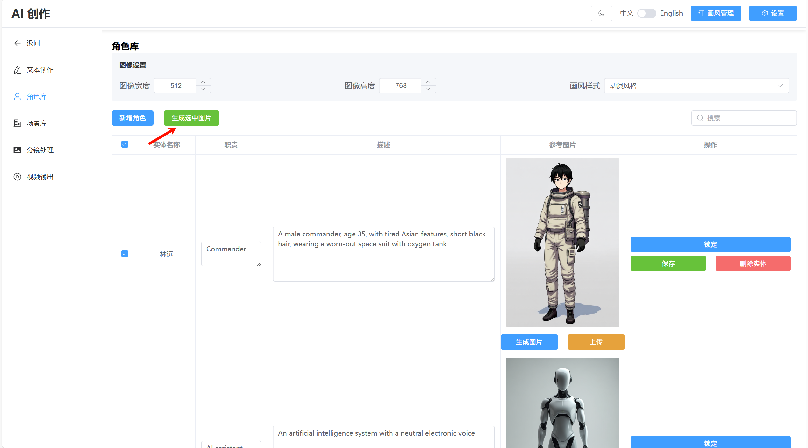

# <p align="center">AI Creation - Smart Creative Content Generation System</p>

<div align="center">

[中文](README.md) | [English](README_EN.md)

[Features](#features) | [Installation](#installation) | [Running Guide](#running-guide) | [Configuration](#configuration) | [Usage Guide](#usage-guide) | [Project Structure](#project-structure)

</div>

## News
- [2025-7-1] 🔥 Major Update: Introduce Flux Kontext, slightly reducing generation speed but significantly increasing character consistency. Added style management and style presets (style presets reference sdxl_prompt_styler).

## Features

This project is an intelligent creative content generation system that helps users:
- Quickly generate creative text content
- Generate images using AI technology
- Automatically synthesize videos
- Maintain consistency using Flux Kontext (Beta)

System Architecture:
- Frontend: VUE3 + TypeScript + Element Plus
- Backend: Python FastAPI framework
- AI Model: Supports OpenAI-compatible API interfaces, using LangChain to call LLMs
- Image Generation: Integrated with ComfyUI
- Audio Generation: Integrated with EdgeTTS
- Content Management: File system-based structured storage

### Output Video Display

https://github.com/user-attachments/assets/f7ca6d56-fd7a-4a3e-aaad-de39cdda456f


## Installation

### Requirements
- Python >= 3.10
- Node.js
- ComfyUI >= 0.3.43

### Setup Steps

1. Install Backend Dependencies
```bash
cd server
pip install -r requirements.txt
```

2. Install Frontend Dependencies
```bash
cd client
npm install
```

3. ComfyUI Model Configuration
- Install node via ComfyUI Manager: `comfy-plasma`
- Install node via ComfyUI Manager: `ComfyUI-nunchaku` (v0.3.3)
- Find `install_wheel.json` in `ComfyUI\custom_nodes\ComfyUI-nunchaku\example_workflows`, load it into ComfyUI, select the latest version (currently v0.3.1), and run the workflow to automatically install nunchaku.
- Ensure CUDA is installed.

> **Models required for this project**:
> - [clip_l](https://www.modelscope.cn/models/comfyanonymous/flux_text_encoders/files) (Path: `ComfyUI\models\text_encoders`)
> - [t5xxl_fp8_e4m3fn](https://www.modelscope.cn/models/comfyanonymous/flux_text_encoders/files) (Same as above)
> - [flux-vae](https://www.modelscope.cn/models/muse/flux_vae/files) (Download `ae.safetensors`, Path: `ComfyUI\models\vae`)
> - [FLUX.1-Turbo-Alpha](https://www.modelscope.cn/models/alimama-creative/FLUX.1-Turbo-Alpha/files) (Download `diffusion_pytorch_model.safetensors`, rename to `flux.1-turbo-alpha.safetensors`, Path: `ComfyUI\models\loras`)
> - [flux.1-kontext-dev](https://modelscope.cn/models/Lmxyy1999/nunchaku-flux.1-kontext-dev/files)
>   - For 50-series GPUs, download: `svdq-fp4_r32-flux.1-kontext-dev.safetensors`
>   - For non-50-series GPUs, download: `svdq-int4_r32-flux.1-kontext-dev.safetensors`
>     (Path: `ComfyUI\models\diffusion_models`)
> 
>  - For 50-series GPUs, download：
   [svdq-fp4-flux.1-dev](https://www.modelscope.cn/models/mit-han-lab/svdq-fp4-flux.1-dev/files)（Download the entire folder，Path：ComfyUI\models\diffusion_models）
> - For non-50-series GPUs, download：
   [svdq-int4-flux.1-dev](https://www.modelscope.cn/models/mit-han-lab/svdq-int4-flux.1-dev)（same）


## Running Guide

1. Start Backend Server
```bash
cd server
python app.py
```

2. Start Frontend Server
```bash
cd client
npm run dev
```

3. Launch ComfyUI
- The default workflow used is `nunchaku-flux.1-dev` (requires 10GB+ VRAM).
- Workflow path: `server/workflow` (can be extended).

> **Note**: When using the default workflow, ensure the required models are downloaded and placed correctly. For non-50 series GPUs, please replace the `svdq-fp4_r32-flux.1-kontext-dev.safetensors` model with the int4 version. If the project's reference image mode is enabled (default), you also need to change the model in the `nunchaku-flux-kontext-multi-images` workflow to the int4 version.


## Configuration

1. Go to the System Configuration Page


2. Reference Image Mode


Enabled by default. When generating storyboard images, it will automatically reference the corresponding character or scene images. If disabled, it will use entity prompt embedding to try to ensure consistency.

3. Configure LLM Service


Key Configuration Items:
- ComfyUI API URL
- LLM API URL
- API Key
- Model Name

> **No Key? How to get an API Key**:
> Register through [this link](https://cloud.siliconflow.cn/i/Je8e1K0b) to get 20 million free tokens.
> After registration, on the main page, select: API Keys → Create New API Key.

You may need to restart the server after modifying the configuration.

## Usage Guide

### 1. Create Project

### 2. Text Creation
- Creation Mode: Directly input your requirements, and the AI will generate content.
- Continuation Mode: Input existing text, and the AI will continue writing.

### 3. Character Extraction

- After saving the text, click "Extract Characters".
- The AI will analyze the text and extract character information.


#### 3.1 Character Library
After extraction, you can view the results in the character library. If "Reference Image Mode" is enabled, you need to generate reference images for all characters.


- If you are not satisfied with a reference image, you can generate it multiple times or modify the prompt and regenerate (remember to save after modifying the prompt).
- For better image generation results, try to generate full-body reference images for characters, and you can generate them multiple times for better outcomes.
- Added the ability to upload local reference images. However, please ensure that the uploaded images match the prompts as closely as possible.

### 4. Chapter Segmentation

- Click "Split Current Chapter".
- The system automatically extracts scenes and creates storyboards.

#### 4.1 Scene Library
After segmentation, you can see the extracted scenes in the scene library.
Similar to the character library, you need to generate reference images for all scenes here as well.


### 5. Storyboard Processing


a) Prompt Conversion:
- Select all elements.
- Click "Convert Selected Prompts".
- Save the modifications.
- Note
   - Entities automatically referenced in scene descriptions may be incomplete. In such cases, you can manually add references using the format {entity_name}.
   - Whether reference image mode is enabled will affect the prompt conversion mode. If you switch the reference image mode, you need to regenerate the prompts.
  

b) Image Generation:
- You can configure resolution and style (Note: When using reference image mode, it is recommended to set the style to basic and not set an additional style).
- When using reference image mode, the workflow will automatically switch to nunchaku-flux-kontext-multi-images. However, currently, at most two reference characters and one reference scene can appear at the same time.
- Click "Generate Selected Images".
- Supports individual regeneration or fine-tuning prompts to generate the desired image.

c) Audio Generation:
- Select the desired segments.
- Click generate audio.

### 6. Video Generation

- Switch to the video generation interface.
- Set the source image resolution based on the image resolution generated during storyboard processing.
- When setting the horizontal or vertical pan range, you can click the "Calculate Recommended Resolution" button. It will proportionally adjust the recommended video resolution width or height based on the horizontal or vertical pan settings. You can also choose not to use this feature and set the resolution freely, but this may result in the image not being fully displayed.
- Click "Generate Video" (takes about 1 minute).


#### Video Hardware Encoding Acceleration (Optional)

To enable NVIDIA GPU acceleration (NVENC), please:

1. Download and extract FFmpeg Builds.
2. Configure environment variables:
   - Add the FFmpeg bin directory to your PATH.
   - Ensure you have NVIDIA drivers installed.
3. Verify the configuration:
   ```bash
   ffmpeg -encoders | findstr nvenc
   ```
   If `h264_nvenc` is displayed, the configuration is successful.

> Note: CPU encoding will be used automatically if not set up.

## Project Structure

```
AICreation/                # Project root
├── client/               # Frontend code
│   ├── src/             # Source code directory
│   │   ├── api/         # API interface directory
│   │   │   ├── project_api.ts # Project related API
│   │   │   ├── chapter_api.ts # Chapter related API
│   │   │   ├── entity_api.ts # Entity related API
│   │   │   ├── media_api.ts # Media generation related API
│   │   │   └── request.ts # Request wrapper, supporting both normal (Axios) and streaming (Fetch API) requests
│   │   ├── components/   # Components directory
│   │   │   ├── Header.vue # Top navigation component
│   │   │   └── ImageSettingsControl.vue # Image settings component
│   │   ├── composables/ # Composables directory
│   │   │   └── useGeneration.ts # Generic generation logic
│   │   ├── locales/     # Internationalization directory
│   │   │   ├── en-US.ts # English language pack
│   │   │   ├── zh-CN.ts # Chinese language pack
│   │   │   └── index.ts # i18n configuration
│   │   ├── router/      # Router configuration directory
│   │   │   └── index.ts # Router configuration file
│   │   ├── store/       # State management directory
│   │   │   └── usePromptStyleStore.ts # Prompt style state management
│   │   ├── styles/      # Styles directory
│   │   ├── utils/       # Utility directory
│   │   ├── views/       # Page views directory
│   │   │   ├── Project/ # Project management page
│   │   │   │   └── index.vue
│   │   │   ├── ProjectMain/ # Project details page
│   │   │   │   ├── index.vue # Main project page
│   │   │   │   ├── EntityLibrary/ # Entity Library (Characters & Scenes)
│   │   │   │   │   └── index.vue
│   │   │   │   ├── StoryboardProcess/ # Storyboard process management
│   │   │   │   │   └── index.vue
│   │   │   │   ├── TextCreation/ # Text creation management
│   │   │   │   │   └── index.vue
│   │   │   │   └── VideoOutput/ # Video output management
│   │   │   │       └── index.vue
│   │   │   ├── PromptStyler/ # Prompt styler management
│   │   │   │   └── index.vue
│   │   │   ├── Setting/ # Settings page
│   │   │   │   └── index.vue
│   │   │   └── NotFound/ # 404 page
│   │   │       └── index.vue
│   │   ├── App.vue      # Root component
│   │   ├── main.ts      # Entry file
│   │   └── env.d.ts     # Type declaration file
│   ├── public/          # Static assets directory
│   ├── index.html       # HTML template
│   ├── package.json     # Project configuration file
│   ├── tsconfig.json    # TypeScript configuration
│   └── vite.config.ts   # Vite configuration
├── server/               # Server-side code
│   ├── config/           # Configuration directory
│   │   ├── config.py     # Configuration operations interface
│   │   └── config.yaml   # System configuration file
│   ├── controllers/      # API interface layer
│   │   ├── project_controller.py # Project management related endpoints
│   │   ├── chapter_controller.py # Chapter management related endpoints
│   │   ├── entity_controller.py # Entity management related endpoints
│   │   ├── media_controller.py   # Media generation related endpoints
│   │   ├── video_controller.py   # Video generation related endpoints
│   │   └── admin_controller.py   # System management endpoints (including config modification)
│   ├── services/         # Business logic layer
│   │   ├── llm_service.py    # LLM related business logic
│   │   ├── image_service.py  # Image generation related business logic
│   │   ├── audio_service.py  # Audio generation related business logic
│   │   ├── video_service.py  # Video generation related business logic
│   │   ├── workflow_service.py # Workflow related business logic
│   │   ├── kg_service.py     # Knowledge graph management business logic
│   │   ├── scene_service.py  # Scene related business logic
│   │   ├── chapter_file_service.py # Chapter file related business logic
│   │   ├── schemas.py        # Pydantic
│   │   └── base_service.py   # Service base class (with singleton)
│   ├── utils/            # Utility directory
│   │   ├── image_effect.py   # Image effects utility
│   │   └── response.py       # API response wrapper utility
│   ├── prompts/          # Prompt templates directory
│   │   ├── novel_writing.txt     # Novel writing prompt
│   │   ├── character_extraction.txt # Character extraction prompt
│   │   └── scene_extraction.txt  # Scene extraction prompt
│   └── workflow/         # Workflow configuration directory
│       └── nunchaku-flux.1-dev.json # Default workflow configuration file
├── projects/             # Projects directory (sibling to server)
│   ├── project1/         # A specific project directory
│   │   ├── kg.json       # Knowledge graph data file
│   │   ├── last_content.txt  # Last generated content
│   │   ├── chapter1/     # Chapter directory
│   │   │   ├── content.txt   # Chapter content file
│   │   │   ├── 1/       # Sub-directory
│   │   │   │   ├── span.txt
│   │   │   │   ├── prompt.json
│   │   │   │   ├── image.png
│   │   │   │   └── audio.mp3
│   │   │   ├── 2/       # Sub-directory
│   │   │   └── ...      # Other sub-directories
│   │   └── ...          # Other chapter directories
│   └── ...              # Other project directories
└── README.md            # Project documentation
```
